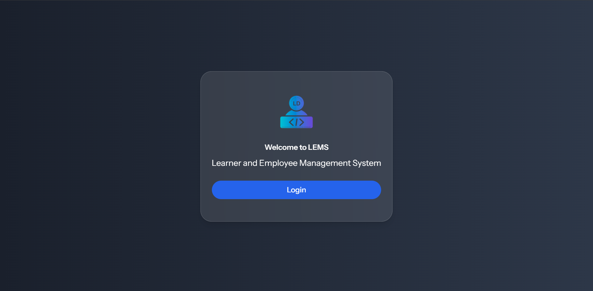
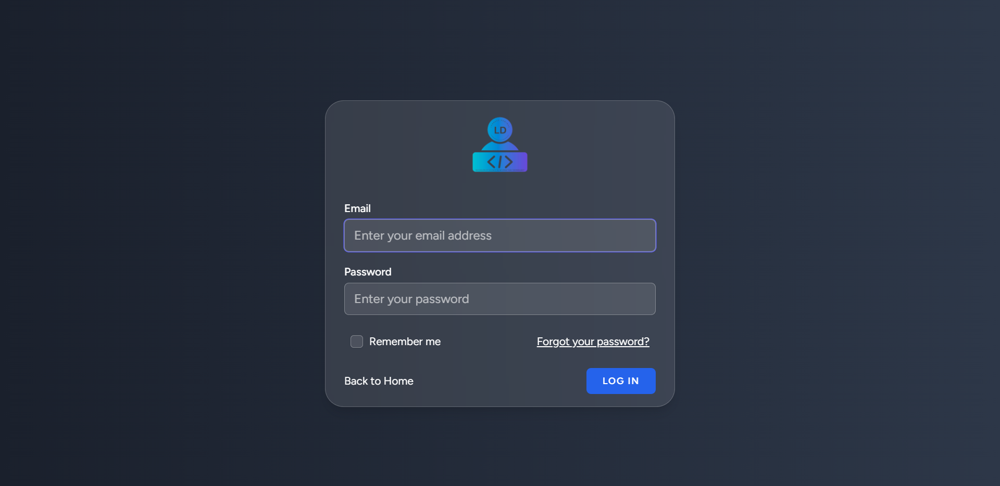
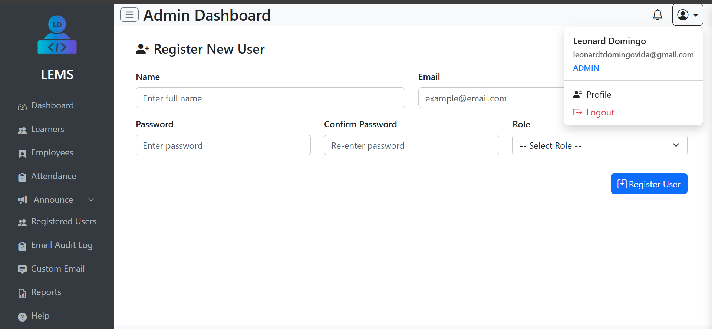
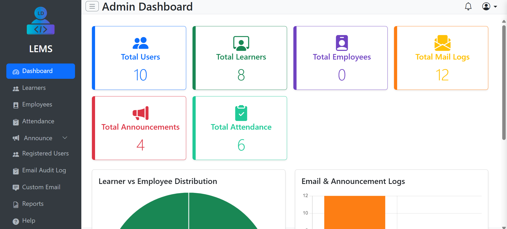

<h1 align="center">🎓 SkillTrack LMS</h1>

<p align="center">
  <b>A Laravel-based Learner Management System with QR attendance, OTP-secured registration, role-based dashboards, email announcements, and audit logs.</b>
</p>

<p align="center">
  
  
  
  
  
  
  
  
</p>

<p align="center">
  <b>QR Attendance</b> •
  <b>OTP Registration</b> •
  <b>Role-Based Access</b> •
  <b>Email Announcements</b> •
  <b>Audit Logs</b>
</p>

---

## 📸 Project Screenshots

> Screenshots are stored inside `public/screenshots/`.

| Landing Page | Login Page |
|---|---|
|  |  |

| Register Page | Admin Dashboard |
|---|---|
|  |  |

## 🚀 Project Overview

**SkillTrack LMS** is a full-stack Laravel web application designed to help schools, training centers, and learning-focused organizations manage learners, users, attendance, announcements, and communication records from one centralized platform.

The system provides a clean role-based dashboard experience for **Admin**, **Employee**, and **Learner** users. It replaces manual attendance sheets and scattered communication with a more secure, structured, and digital workflow.

This project demonstrates practical Laravel development skills including authentication, authorization, database migrations, seeders, role-based access control, QR attendance, email workflows, audit logging, and responsive UI development.

---

## 🎯 Project Purpose

Many institutions still manage learner records, attendance, and announcements manually. This often creates problems such as:

- ❌ Attendance errors caused by manual entry
- ❌ Slow learner record management
- ❌ Unorganized communication
- ❌ No clear email or announcement history
- ❌ Weak user access control
- ❌ Difficulty tracking learner attendance sessions

**SkillTrack LMS** solves these problems by providing a secure and organized learner management platform with modern Laravel features.

---

## 🎯 Key Highlights

- 🎓 Learner management system built with Laravel 12
- 📲 QR code-based attendance logging
- 🕘 AM and PM attendance session support
- 🔐 Secure authentication using Laravel Breeze
- 🧾 OTP-secured registration workflow
- 👥 Role-based access for Admin, Employee, and Learner users
- 🛡️ Permission handling using Spatie Laravel Permission
- 📢 Email announcement system
- 🎯 Announcement filtering by user, grade level, and section
- 📬 Email audit logs for tracking communication activity
- 📊 Dashboard-based system navigation
- 📱 Responsive and mobile-friendly interface
- 🎨 UI built with Tailwind CSS, Bootstrap 5, and SweetAlert2
- 🗄️ MySQL database with Laravel migrations and seeders

---

## ✨ Features

### 👥 User & Role Features

| Feature | Description |
|---|---|
| Authentication | Users can register, login, and logout securely |
| OTP Verification | Registration can be protected through OTP verification |
| Role-Based Access | Different dashboards and permissions for each user role |
| Admin Role | Can manage users, learners, attendance, announcements, and logs |
| Employee Role | Can access assigned management and learner-related features |
| Learner Role | Can access learner-specific pages and attendance-related features |
| Protected Routes | Pages are protected based on login status and assigned role |
| User Management | Admin can manage system users and access levels |

---

### 📲 Attendance Features

| Feature | Description |
|---|---|
| QR Attendance | Learners can be marked through QR-based attendance |
| Session Support | Attendance supports AM and PM sessions |
| Attendance Records | Attendance data is stored and managed digitally |
| Faster Workflow | Reduces manual attendance collection time |
| Error Reduction | Helps minimize duplicate or incorrect manual records |
| Admin Visibility | Attendance records can be monitored from the system dashboard |

---

### 📢 Announcement Features

| Feature | Description |
|---|---|
| Email Announcements | Send important announcements through email |
| User Filtering | Send announcements to selected users |
| Grade Level Filtering | Target learners by grade level |
| Section Filtering | Target learners by section |
| Organized Communication | Keeps announcements structured and traceable |
| Announcement History | Helps maintain a record of communication activity |

---

### 📬 Audit Log Features

| Feature | Description |
|---|---|
| Email Logs | Track sent announcement emails |
| Activity Records | Maintain communication history |
| Admin Monitoring | Admin can review announcement activity |
| Transparency | Improves system accountability |
| Debug Support | Helps verify communication-related actions |

---

## 🧑‍💼 User Roles

| Role | Access Level |
|---|---|
| 👑 Admin | Full system access, user management, learner management, attendance, announcements, and audit logs |
| 🧑‍💼 Employee | Access to assigned operational features and learner-related tools |
| 🎓 Learner | Access to learner-specific pages and attendance-related functionality |

---

## 🛠 Tech Stack

| Layer | Technologies |
|---|---|
| Backend | Laravel 12, PHP 8.2+ |
| Database | MySQL / MariaDB |
| Authentication | Laravel Breeze |
| Authorization | Spatie Laravel Permission |
| Frontend | Blade, Tailwind CSS, Bootstrap 5 |
| UI Enhancements | SweetAlert2 |
| Build Tool | Vite |
| Package Management | Composer, NPM |
| Local Environment | XAMPP, Laragon, WAMP, or Laravel local server |

---

## 🏗 Architecture Overview

SkillTrack LMS follows Laravel's MVC architecture with organized routes, controllers, models, migrations, seeders, Blade views, and middleware-based access control.

```text
skilltrack-lms/
├── app/
│   ├── Http/
│   │   ├── Controllers/
│   │   ├── Middleware/
│   │   └── Requests/
│   ├── Models/
│   └── Providers/
├── bootstrap/
├── config/
├── database/
│   ├── factories/
│   ├── migrations/
│   └── seeders/
├── public/
│   └── screenshots/
├── resources/
│   ├── css/
│   ├── js/
│   └── views/
├── routes/
│   ├── web.php
│   └── auth.php
├── storage/
├── tests/
├── .env.example
├── artisan
├── composer.json
├── package.json
└── README.md
```

---

## 🔄 Application Flow

### User Registration Flow

```text
User Registration
        ↓
OTP Verification
        ↓
Account Creation
        ↓
Role Assignment
        ↓
Dashboard Access
```

### Attendance Flow

```text
Learner / Admin Access
        ↓
QR Attendance Scan
        ↓
AM / PM Session Selection
        ↓
Attendance Record Saved
        ↓
Admin Can Review Attendance
```

### Announcement Flow

```text
Admin Creates Announcement
        ↓
Selects Users / Grade / Section
        ↓
Email Announcement Sent
        ↓
Email Activity Stored in Audit Logs
```

---

## 🗄 Database Overview

The system uses a MySQL database managed through Laravel migrations and seeders.

### Main Data Areas

| Data Area | Purpose |
|---|---|
| Users | Stores Admin, Employee, and Learner accounts |
| Roles & Permissions | Stores role-based access rules |
| Learners | Stores learner-related records |
| Attendance | Stores QR-based attendance logs |
| Announcements | Stores announcement-related data |
| Email Logs | Tracks sent email activity |
| OTP Records | Supports secure registration verification |

---

## 🔐 Security Implementations

| Security Area | Implementation |
|---|---|
| Authentication | Laravel Breeze authentication scaffolding |
| Password Security | Passwords are hashed using Laravel's hashing system |
| OTP Verification | Registration flow can be protected using OTP |
| Role-Based Access | Spatie Laravel Permission manages roles and permissions |
| Protected Routes | Middleware restricts unauthorized access |
| Environment Security | Sensitive credentials are stored in `.env` |
| CSRF Protection | Laravel includes CSRF protection for forms |
| Validation | Laravel request validation can protect form inputs |
| Audit Logs | Email activity can be reviewed by administrators |

> Recommended production improvements: enable HTTPS, configure production mail settings, use strong database credentials, disable debug mode, add rate limiting to OTP requests, and review permissions before deployment.

---

## ⚡ Performance & Code Quality

- Uses Laravel MVC structure for maintainability
- Uses migrations and seeders for repeatable database setup
- Uses Laravel Breeze for clean authentication scaffolding
- Uses Spatie Permission for scalable role management
- Uses Vite for modern frontend asset bundling
- Uses reusable Blade views and layouts
- Uses MySQL for structured relational data
- Uses responsive UI components for better user experience
- Keeps sensitive environment data outside version control

---

## 📡 Routes / System Areas

| Area | Purpose |
|---|---|
| `/` | Landing page |
| `/login` | User login |
| `/register` | User registration |
| `/dashboard` | Role-based dashboard access |
| Admin Dashboard | Admin-level system management |
| Learner Management | Manage learner-related records |
| Attendance | QR attendance and attendance records |
| Announcements | Create and send email announcements |
| Email Logs | Review communication audit logs |

> Actual route names may vary depending on your final route configuration.

---

## ⚙️ Installation Guide

### Requirements

- PHP 8.2 or higher
- Composer
- Node.js and NPM
- MySQL / MariaDB
- XAMPP, WAMP, Laragon, or similar local environment
- phpMyAdmin recommended
- Git

---

### 1️⃣ Clone the Repository

```bash
git clone https://github.com/CodeByMan/skilltrack-lms.git
cd skilltrack-lms
```

---

### 2️⃣ Install PHP Dependencies

```bash
composer install
```

---

### 3️⃣ Install Frontend Dependencies

```bash
npm install
```

---

### 4️⃣ Create Environment File

For Windows:

```bash
copy .env.example .env
```

For macOS/Linux:

```bash
cp .env.example .env
```

---

### 5️⃣ Generate Application Key

```bash
php artisan key:generate
```

---

### 6️⃣ Configure Database

Create a new MySQL database:

```sql
CREATE DATABASE skilltrack_lms;
```

Update your `.env` file:

```env
DB_DATABASE=skilltrack_lms
DB_USERNAME=root
DB_PASSWORD=
```

Update the database username and password according to your local MySQL setup.

---

### 7️⃣ Configure Mail Settings

For local testing, you can use Mailtrap, Gmail SMTP, or Laravel log mail.

Example local log configuration:

```env
MAIL_MAILER=log
MAIL_FROM_ADDRESS="noreply@skilltrack.test"
MAIL_FROM_NAME="SkillTrack LMS"
```

For SMTP testing, update the mail settings in `.env` according to your provider.

---

### 8️⃣ Run Migrations and Seeders

```bash
php artisan migrate:fresh --seed
```

---

### 9️⃣ Link Storage

```bash
php artisan storage:link
```

---

### 🔟 Start the Laravel Server

```bash
php artisan serve
```

---

### 1️⃣1️⃣ Start Vite Development Server

Open another terminal and run:

```bash
npm run dev
```

Now open the project in your browser:

```text
http://127.0.0.1:8000
```

---

## 🏗 Build for Production

To compile frontend assets for production:

```bash
npm run build
```

For production deployment, also make sure to configure:

```env
APP_ENV=production
APP_DEBUG=false
```

---

## 🔑 Demo Credentials

Use these demo accounts after running the database seeders.

### Admin

```text
Email: admin@skilltrack.test
Password: password
```

### Employee

```text
Email: employee@skilltrack.test
Password: password
```

### Learner

```text
Email: learner@skilltrack.test
Password: password
```

> Demo credentials are for local testing only. Change them before deploying the project.

---

## 📁 Important Folder Structure

```text
app/
├── Http/
│   ├── Controllers/
│   ├── Middleware/
│   └── Requests/
├── Models/
└── Providers/

database/
├── migrations/
└── seeders/

resources/
├── css/
├── js/
└── views/

routes/
├── web.php
└── auth.php

public/
└── screenshots/

storage/
└── app/
```

---

## 🧪 Testing Checklist

- [ ] Install Composer dependencies
- [ ] Install NPM dependencies
- [ ] Create `.env` file
- [ ] Generate application key
- [ ] Create MySQL database
- [ ] Run migrations and seeders
- [ ] Start Laravel development server
- [ ] Start Vite development server
- [ ] Login as Admin
- [ ] Login as Employee
- [ ] Login as Learner
- [ ] Test role-based dashboard access
- [ ] Test learner management pages
- [ ] Test QR attendance workflow
- [ ] Test AM attendance session
- [ ] Test PM attendance session
- [ ] Test email announcement creation
- [ ] Test announcement filters
- [ ] Test email audit logs
- [ ] Test responsive screens on mobile
- [ ] Run production asset build

---

## ✅ Recruiter Highlights

This project demonstrates practical full-stack Laravel development skills, including:

- ✅ Laravel MVC architecture
- ✅ Authentication using Laravel Breeze
- ✅ Role-based access control
- ✅ Spatie Laravel Permission integration
- ✅ MySQL database design
- ✅ Laravel migrations and seeders
- ✅ OTP-secured registration workflow
- ✅ QR-based attendance system
- ✅ Email announcement workflow
- ✅ Email audit logging
- ✅ Responsive dashboard UI
- ✅ Blade templating
- ✅ Vite asset compilation
- ✅ Environment-based configuration
- ✅ Real-world admin panel workflow
- ✅ Clean portfolio-ready documentation

---

## 🚀 Future Improvements

- 📊 Attendance reports and analytics
- 📄 PDF report generation
- 📥 CSV/Excel learner import
- 📤 Export attendance records
- 🔔 Real-time notifications
- 📱 REST API support for mobile apps
- 🏫 Multi-campus or multi-branch support
- 👨‍👩‍👧 Parent or guardian portal
- 📈 Advanced dashboard charts
- 💬 SMS notification support
- 🌐 Public API documentation
- 🧠 Learner performance insights
- 🗓️ Attendance calendar view
- 🔍 Advanced search and filters
- 🧪 Automated feature tests
- 🐳 Docker setup for easier deployment

---

## 🔒 Security Notes

Before pushing this project to GitHub, make sure these files and folders are not committed:

```text
.env
/vendor
/node_modules
/storage/*.key
```

Your `.env` file contains sensitive information and should never be uploaded publicly.

Use `.env.example` for public environment configuration examples.

Recommended production settings:

```env
APP_ENV=production
APP_DEBUG=false
```

---

## 📌 Repository Information

Recommended repository name:

```text
skilltrack-lms
```

Suggested repository description:

```text
A Laravel-based Learner Management System with QR attendance, OTP registration, role-based access, email announcements, and audit logs.
```

Suggested topics:

```text
laravel php mysql learner-management-system lms qr-attendance role-based-access laravel-breeze spatie-permission tailwindcss bootstrap
```

---

## 👨‍💻 Author

**Muhammad Ali Nawaz**  
Full-Stack PHP / Laravel Developer

- GitHub: [CodeByMan](https://github.com/CodeByMan)

Built as a portfolio project to demonstrate practical Laravel development, learner management workflows, QR attendance, role-based access control, authentication, email announcements, audit logs, and responsive dashboard design.

---

## 📄 License

This project is open-sourced software licensed under the [MIT license](LICENSE).

---

<p align="center">
  <b>⭐ If you like this project, consider starring the repository!</b>
</p>

<p align="center">
  <b>🎓 SkillTrack LMS — Smart Learner Management with Laravel</b>
</p>
